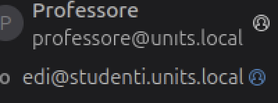
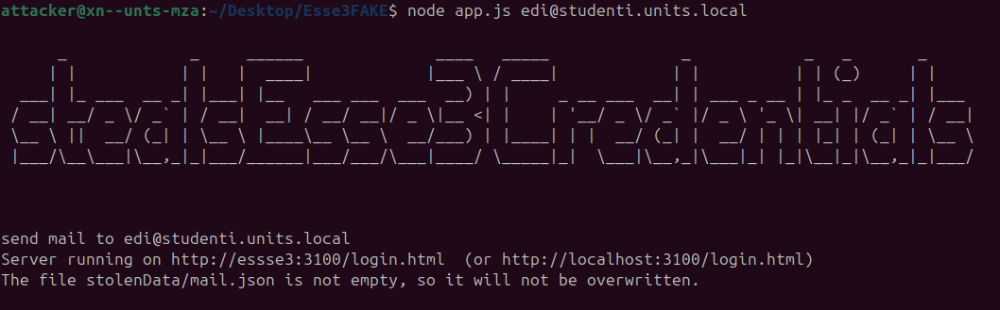
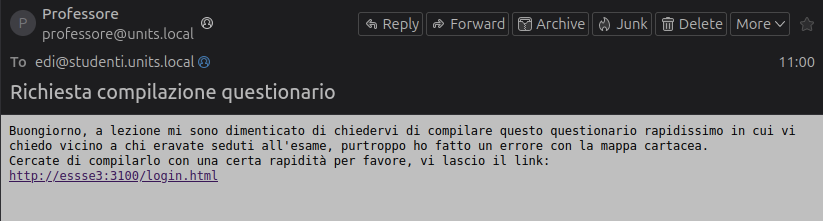
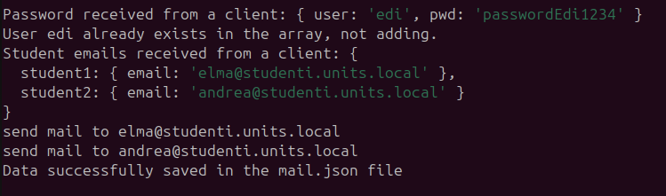

# REPORT OF CYBERSECURITY PROJECT

## Introduzione

Il progetto consiste in un attacco per rubare le credenziali Esse3 degli studenti del corso di ingegneria elettronica e informatica. L'attaccante deve conoscere almeno una mail di uno studente, quindi invia una mail di phishing (il mittente si maschera da professore) in cui si richiedere di compilare un questionario: una volta effettuato l’accesso, si devono inserire i nomi degli studenti che erano seduti vicini durante la prova d’esame, in modo da ricostruire la mappa degli studenti in aula. 
Il programma riceve le credenziali dello studente e i nomi degli altri studenti, ricrea la loro mail e invia il messaggio di phishing anche a loro.
L’attacco non produce un effetto dannoso immediato per il singolo studente, che potrebbe non accorgersi del danno; tuttavia, in poco tempo l’attaccante dovrebbe riuscire a ottenere le credenziali di molti studenti del corso.
L’attacco ha senso perché Esse3 non prevede autenticazione a due fattori.
Specifico che l’idea è personale e che conosco alcune delle tecnologie utilizzate per la demo (in seguito specifico i dettagli).


## Tecnologie utilizzate

1. **Ubuntu su Virtualbox**: 
    La dimostrazione viene effettuata tramite l’uso di 2 macchine virtuali Ubuntu con Virtualbox.

2. **NodeJS**: 
    Ho realizzato un sito web clone di Esse3 utilizzando NodeJs (ho utilizzato un’estensione di Chrome eXtract Snippet per clonare il portale: mi ha permesso di ottenere tutti i file HTML e CSS) e le mie conoscenze pregresse di programmazione web (e un po’ di aiuto da Chat GPT per velocizzare la scrittura di codice), per creare un sito il più simile possibile a quello reale (il sito si articola in alcune pagine HTML, file CSS e JavaScript modificato per i miei scopi).

3. **JSON**: 
    Per la raccolta e la gestione dei dati (credenziali e indirizzi mail).

4. **Bash Script**: 
    Ho realizzato un programma in Bash per l’invio di mail automatizzato: il parametro che prende in ingresso il programma è l’indirizzo mail del destinatario, mentre il mittente è sempre lo stesso, quello dell’attaccante.

5. **Git**: 
    Ho utilizzato Git con Github per la scrittura del programma e ho mantenuto la repository privata, sul mio account personale (avevo già usato in passato Git con GitLab).

6. **Server di posta elettronica (Postfix e Dovecot)**: 
    Ho utilizzato i pacchetti Postfix e Dovecot per realizzare 2 server di posta situati nelle macchine virtuali Linux. Questi strumenti mi permettono di creare dei server di posta che funzionano nella rete locale e mi permettono di usare un nome di dominio a mia scelta (in questo caso, non registrato ma funzionante solo nella rete privata). Per questo lavoro ho dovuto fare una lunga ricerca e consultare più fonti per capire come usare questi servizi.

7. **Punycode**: 
    Ho usato lo strumento Punycode per creare un dominio di posta molto simile a quello reale, ma in realtà diverso (è un dominio che potrebbe teoricamente essere comprato e utilizzato su internet).
    Punycode è un sistema di codifica usato per rappresentare nomi di dominio che contengono caratteri non-ASCII. Viene utilizzato per consentire la rappresentazione di caratteri internazionali all'interno del sistema dei nomi di dominio (DNS), che originariamente supporta solo i caratteri ASCII (lettere latine senza accenti, numeri e trattino).
    Punycode converte un nome di dominio che contiene caratteri Unicode (come lettere accentate, caratteri cinesi, arabi, ecc.) in una stringa di caratteri ASCII. Questo viene fatto in modo che il nome di dominio possa essere gestito dai server DNS esistenti.
    Nel mio caso, ho usato Punycode per trasformare `units.local` in `unıts.local` (la prima `i` che compare è in realtà un carattere che non appartiene all’alfabeto latino).
    La rappresentazione corretta della stringa Punycode è `xn--unts-2pa.local`.  
    


## Configurazione dei nomi di dominio

Per la realizzazione del progetto è stata fondamentale la modifica del file `/etc/hosts` su entrambe le macchine virtuali.

Il file `/etc/hosts` su Linux è un file di configurazione che mappa gli indirizzi IP ai nomi di dominio. Funziona come un elenco locale per la risoluzione dei nomi di dominio, consentendo al sistema di tradurre i nomi di dominio in indirizzi IP senza dover consultare un server DNS esterno. In pratica, specifica quali indirizzi IP corrispondono a determinati nomi di dominio, permettendo una risoluzione rapida e locale dei nomi di rete.

```bash
cat /etc/hosts
127.0.0.1 localhost
127.0.1.1 vm-VirtualBox
10.0.2.6 studenti.units.local
10.0.2.7 xn--unts-mza.local essse3
...
```

In entrambe le macchine virtuali, ho mappato gli indirizzi a:
- `units.studenti.local`: per rendere funzionante il servizio di posta elettronica universitario.
- `xn--unts-2pa.local`: per rendere funzionante il servizio di posta elettronica universitario fasullo (il servizio dell’attaccante).
- `essse3.local`: il dominio fasullo del portale Esse3 universitario.

## Configurazione dei server di posta elettronica

Per la configurazione dei server di posta ho dovuto consultare numerose guide online. I due servizi che ho usato sono Postfix e Dovecot.

- **Postfix**: È un Mail Transfer Agent (MTA) che si occupa dell'invio e della ricezione di email da e verso altri server di posta. Gestisce quindi il routing e la consegna delle email.

- **Dovecot**: È un Mail Delivery Agent (MDA) e un IMAP/POP3 server. Dovecot gestisce l'archiviazione delle email e fornisce accesso agli utenti per leggere le loro email tramite client di posta elettronica, utilizzando i protocolli IMAP e POP3.

Cofigurazione `/etc/postfix/main.cf` per studenti.units.local (mosto solo quello che è necessario modificare, il resto da lasciare invariato):
```
mydomain = studenti.units.local
myorigin = /etc/mailname
mydestination = $myhostname, studenti.units.local
mynetworks = 127.0.0.0/8 [::ffff:127.0.0.0]/104 [::1]/128 10.0.2.0/24
home_mailbox = Maildir/
relay_domains = xn--unts-mza.local
transport_maps = hash:/etc/postfix/transport # for the comunication with xn--unts-2pa.local
```
Analogamente ho modificato anche la configurazione per xn--unts-mza.local (relay_domains sarà uguale a studenti.units.local).

Cofigurazione `/etc/dovecot/dovecot.conf` per entrami i server (mosto solo quello che è necessario modificare, il resto da lasciare invariato):
```
protocols = imap pop3
mail_location = maildir:~/Maildir
```


Ho utilizzato Mozilla Thunderbird come client di posta elettronica per gli utenti (gli studenti). Ho aggiunto in un unica macchina tutti gli utentei, per facilitare la mia dimostrazione.

## Configurazione delle macchine virtuali


Uso 2 macchine virtuali Ubuntu nella stessa rete con NAT (una rete solo per queste 2 macchine e per questa demo).

- **Ubuntu 1**: 
  Il server di posta elettronica è sempre attivo (si avvia con il boot) e simula il server di posta elettronica di ateneo (il dominio è `units.local`).
  Nella stessa macchina uso il client di posta elettronica Mozilla Thunderbird con registrati alcuni account di posta elettronica. Gli account appartengono a studenti diversi, quindi in teoria sarebbe stato più corretto usare altre macchine virtuali, ma non è stato possibile per questioni di risorse dell’host. Gli account possono scambiarsi mail tra loro, proprio come due normali indirizzi di posta elettronica.

- **Ubuntu 2**: 
  Anche in questa macchina il server di posta elettronica è sempre attivo e serve per inviare mail da parte dell’attaccante. Il dominio è `unıts.it` (usando Punycode: `xn--unts-2pa.it`).
  È presente anche il programma Node.js che l’attaccante usa per:
    - Hostare il sito web clone.
    - Automatizzare l'attacco.
    - Ottenere e gestire i dati rubati.

## Procedimento

Con il comando `node app.js user@studenti.units.local` avvio il server Node.js e metto "online" il sito web fasullo dell'università. Posso verificare che sia effettivamente online e raggiungibile dal dominio `essse3.it`. Non ho usato Punycode per la falsificazione del sito web perché mi sono accorto che il browser Chrome se ne accorge e blocca il sito, quindi ho scelto un’altra tecnica di inganno: ho aggiunto una "s" al nome "esse", sperando che gli utenti non se ne accorgano.

Ho scritto uno script che automatizza l’invio di mail: è sufficiente indicare come parametro la mail del destinatario e il programma invia una mail a nome del professore, contenente il link del sito web malevolo.
```bash
#!/bin/bash

recipient=$1
subject="Richiesta compilazione questionario"
body="Buongiorno, a lezione mi sono dimenticato di chiedervi di compilare questo questionario rapidissimo in cui vi chiedo vicino a chi eravate seduti all'esame, purtroppo ho fatto un errore con la mappa cartacea.
Cercate di compilarlo con una certa rapidità per favore, vi lascio il link: 
http://essse3:3100/login.html"

# Crea il messaggio email
email="To: $recipient
Subject: $subject

$body"

# Invia l'email usando sendmail
echo "$email" | sendmail -F "Professore" -f "professore@xn--unts-mza.local" "$recipient"

```
Cosa vede la vittima:  

Se lo stesso messaggio viene aperto con un editor di testo possiamo leggere questo:  
```
Return-Path: <professore@unıts.local>
X-Original-To: edi@studenti.units.local
Delivered-To: edi@studenti.units.local
Received: from xn--unts-mza.local (xn--unts-mza.local [10.0.2.7])
  by gabriele-V (Postfix) with UTF8SMTPS id 5CB56100BEF
  for <edi@studenti.units.local>; Tue,  4 Jun 2024 11:00:02 +0200 (CEST)
Received: by xn--unts-mza.local (Postfix, from userid 1000)
  id 227039FFFB; Tue,  4 Jun 2024 11:00:47 +0200 (CEST)
To: edi@studenti.units.local
Subject: Richiesta compilazione questionario
Message-Id: <20240604090047.227039FFFB@xn--unts-mza.local>
Date: Tue,  4 Jun 2024 11:00:47 +0200 (CEST)
From: Professore <professore@unıts.local>

Buongiorno, a lezione mi sono dimenticato di chiedervi di compilare questo questionario rapidissimo in cui vi chiedo vicino a chi eravate seduti all'esame, purtroppo ho fatto un errore con la mappa cartacea.
Cercate di compilarlo con una certa rapidità per favore, vi lascio il link: 
http://essse3:3100/login.html
```

L’attaccante ora aspetta che la vittima compili il questionario.  
Quando il questionario è compilato, il server riceve le credenziali e i nomi e cognomi di altri due studenti. Il programma ricrea la loro mail e invia automaticamente la mail di phishing anche a loro. Si può dire quindi che la velocità di diffusione teorica e ottimistica sia esponenziale.  

Se ad uno studente è già stata inviata la mail, non ne verranno inviate altre. Se uno studente si trova ad una estremità dell’aula, può lasciare vuoto uno dei due campi e citare il nome di solo uno studente.

## Conclusioni e possibili miglioramenti

Il programma è dimostrativo e non tiene conto di molti aspetti che andrebbero migliorati per rendere l’attacco più efficace. Alcuni limiti:

- Ho usato la lingua italiana per il sito di Esse3, perché credo che la maggioranza degli studenti lo consulti in italiano, tuttavia è anche disponibile la versione inglese che nel mio progetto non è possibile attivare (gli studenti Erasmus potrebbero insospettirsi).
- Le uniche informazioni richieste sono i nomi degli studenti che si sono seduti vicini durante la prova d’esame: lo studente si può dimenticare o semplicemente non conoscere l’identità di uno o più colleghi.
- Un grande limite è che l’espansione del phishing è solo sulla singola fila di banchi. Più efficace sarebbe chiedere altre informazioni, per esempio gli studenti con cui si ha studiato e gli studenti seduti davanti e dietro.

Ritengo molto probabile che un attacco di questo tipo possa essere scoperto in poco tempo, solo se effettuato in periodo di lezioni, questo perché è probabile che tra studenti e professore qualcuno esprima sospetto. Potrebbe essere più efficace invece effettuare l’attacco al termine delle lezioni, durante la sessione di esami (subito dopo l’esame appunto).

L’obiettivo dell’attaccante in questo caso non sono soldi, ma dati sensibili. L’attaccante dovrebbe essere veloce a entrare nel portale Esse3 con le credenziali rubate, e rubare ulteriori dati riguardanti il singolo studente: informazioni di contatto, fototessera, informazioni sulle tasse e quindi sui redditi, dati bancari (IBAN).

